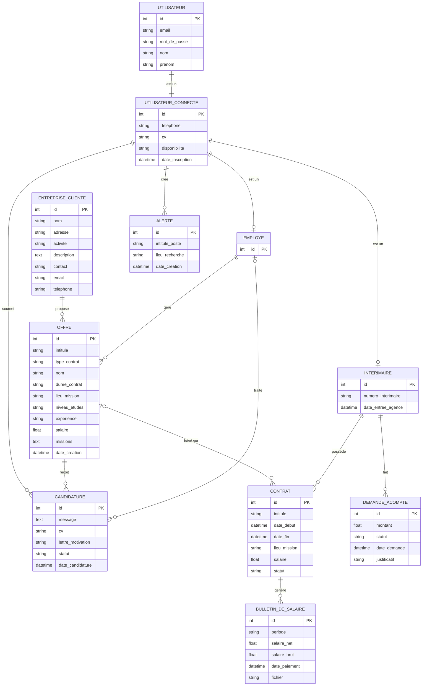

# Modèle Conceptuel de Données (MCD) — Propax

> Basé sur le diagramme de classes UML du projet.  
> Méthode : **Merise** — notation `(cardinalité_min, cardinalité_max)`.

---

## 1. Stratégie de gestion de l'héritage

Le diagramme de classes présente une hiérarchie d'héritage :

```
Utilisateur
└── UtilisateurConnecte
    ├── Employe
    └── Interimaire
```

**Stratégie retenue : Table par sous-type** (`Table per Subtype`)

Chaque entité possède sa propre table. Les tables filles partagent la même clé primaire que la table parente (FK = PK). Cette approche normalise les données tout en respectant la hiérarchie :

| Table                  | Relation avec la parente                        |
| ---------------------- | ----------------------------------------------- |
| `utilisateur`          | Table racine                                    |
| `utilisateur_connecte` | FK `id_utilisateur` → `utilisateur.id`          |
| `employe`              | FK `id_utilisateur` → `utilisateur_connecte.id` |
| `interimaire`          | FK `id_utilisateur` → `utilisateur_connecte.id` |

---

## 2. Entités et attributs

### UTILISATEUR

> Entité abstraite : jamais instanciée directement.

| Attribut     | Type         | Contraintes        |
| ------------ | ------------ | ------------------ |
| **#id**      | INT          | PK, AUTO_INCREMENT |
| email        | VARCHAR(255) | NOT NULL, UNIQUE   |
| mot_de_passe | VARCHAR(255) | NOT NULL (bcrypt)  |
| nom          | VARCHAR(100) | NOT NULL           |
| prenom       | VARCHAR(100) | NOT NULL           |

---

### UTILISATEUR_CONNECTE

> Spécialisation de UTILISATEUR.

| Attribut         | Type         | Contraintes                  |
| ---------------- | ------------ | ---------------------------- |
| **#id**          | INT          | PK, FK → UTILISATEUR.id      |
| telephone        | VARCHAR(20)  |                              |
| cv               | VARCHAR(255) | chemin de fichier (filepath) |
| disponibilite    | VARCHAR(100) |                              |
| date_inscription | DATETIME     | DEFAULT CURRENT_TIMESTAMP    |

---

### EMPLOYE

> Spécialisation de UTILISATEUR_CONNECTE (back-office agence).

| Attribut | Type | Contraintes                      |
| -------- | ---- | -------------------------------- |
| **#id**  | INT  | PK, FK → UTILISATEUR_CONNECTE.id |

_Aucun attribut propre à ce niveau ; le rôle est différencié par l'appartenance à cette table._

---

### INTERIMAIRE

> Spécialisation de UTILISATEUR_CONNECTE.

| Attribut           | Type        | Contraintes                      |
| ------------------ | ----------- | -------------------------------- |
| **#id**            | INT         | PK, FK → UTILISATEUR_CONNECTE.id |
| numero_interimaire | VARCHAR(50) | UNIQUE                           |
| date_entree_agence | DATETIME    |                                  |

---

### ENTREPRISE_CLIENTE

| Attribut    | Type         | Contraintes        |
| ----------- | ------------ | ------------------ |
| **#id**     | INT          | PK, AUTO_INCREMENT |
| nom         | VARCHAR(255) | NOT NULL           |
| adresse     | VARCHAR(255) |                    |
| activite    | VARCHAR(100) |                    |
| description | TEXT         |                    |
| contact     | VARCHAR(255) |                    |
| email       | VARCHAR(255) |                    |
| telephone   | VARCHAR(20)  |                    |

---

### OFFRE

| Attribut       | Type         | Contraintes                           |
| -------------- | ------------ | ------------------------------------- |
| **#id**        | INT          | PK, AUTO_INCREMENT                    |
| intitule       | VARCHAR(255) | NOT NULL                              |
| type_contrat   | VARCHAR(50)  | NOT NULL                              |
| nom            | VARCHAR(255) |                                       |
| duree_contrat  | VARCHAR(100) |                                       |
| lieu_mission   | VARCHAR(255) |                                       |
| niveau_etudes  | VARCHAR(100) |                                       |
| experience     | VARCHAR(100) |                                       |
| salaire        | FLOAT        |                                       |
| missions       | TEXT         |                                       |
| date_creation  | DATETIME     | DEFAULT CURRENT_TIMESTAMP             |
| #id_entreprise | INT          | FK → ENTREPRISE_CLIENTE.id, NOT NULL  |
| #id_employe    | INT          | FK → EMPLOYE.id (créateur de l'offre) |

---

### CANDIDATURE

| Attribut          | Type                                      | Contraintes                            |
| ----------------- | ----------------------------------------- | -------------------------------------- |
| **#id**           | INT                                       | PK, AUTO_INCREMENT                     |
| message           | TEXT                                      |                                        |
| cv                | VARCHAR(255)                              | filepath                               |
| lettre_motivation | VARCHAR(255)                              | filepath                               |
| statut            | ENUM('en_attente', 'acceptée', 'refusée') | DEFAULT 'en_attente'                   |
| date_candidature  | DATETIME                                  | DEFAULT CURRENT_TIMESTAMP              |
| #id_offre         | INT                                       | FK → OFFRE.id, NOT NULL                |
| #id_utilisateur   | INT                                       | FK → UTILISATEUR_CONNECTE.id, NOT NULL |
| #id_employe       | INT                                       | FK → EMPLOYE.id (gestionnaire)         |

_Contrainte d'unicité : `(id_offre, id_utilisateur)` — un utilisateur ne peut postuler qu'une fois par offre._

---

### CONTRAT

| Attribut        | Type                                    | Contraintes                   |
| --------------- | --------------------------------------- | ----------------------------- |
| **#id**         | INT                                     | PK, AUTO_INCREMENT            |
| intitule        | VARCHAR(255)                            | NOT NULL                      |
| date_debut      | DATETIME                                | NOT NULL                      |
| date_fin        | DATETIME                                |                               |
| lieu_mission    | VARCHAR(255)                            |                               |
| salaire         | FLOAT                                   |                               |
| statut          | ENUM('en_cours', 'à_signer', 'terminé') | DEFAULT 'à_signer'            |
| #id_offre       | INT                                     | FK → OFFRE.id (nullable)      |
| #id_interimaire | INT                                     | FK → INTERIMAIRE.id, NOT NULL |

---

### BULLETIN_DE_SALAIRE

| Attribut      | Type         | Contraintes               |
| ------------- | ------------ | ------------------------- |
| **#id**       | INT          | PK, AUTO_INCREMENT        |
| periode       | VARCHAR(50)  | NOT NULL (ex: '2026-03')  |
| salaire_net   | FLOAT        | NOT NULL                  |
| salaire_brut  | FLOAT        | NOT NULL                  |
| date_paiement | DATETIME     |                           |
| fichier       | VARCHAR(255) | filepath (PDF généré)     |
| #id_contrat   | INT          | FK → CONTRAT.id, NOT NULL |

---

### DEMANDE_ACOMPTE

| Attribut        | Type                                      | Contraintes                   |
| --------------- | ----------------------------------------- | ----------------------------- |
| **#id**         | INT                                       | PK, AUTO_INCREMENT            |
| montant         | FLOAT                                     | NOT NULL                      |
| statut          | ENUM('en_attente', 'acceptée', 'refusée') | DEFAULT 'en_attente'          |
| date_demande    | DATETIME                                  | DEFAULT CURRENT_TIMESTAMP     |
| justificatif    | VARCHAR(255)                              | filepath                      |
| #id_interimaire | INT                                       | FK → INTERIMAIRE.id, NOT NULL |

---

### ALERTE

| Attribut        | Type         | Contraintes                            |
| --------------- | ------------ | -------------------------------------- |
| **#id**         | INT          | PK, AUTO_INCREMENT                     |
| intitule_poste  | VARCHAR(255) |                                        |
| lieu_recherche  | VARCHAR(255) |                                        |
| date_creation   | DATETIME     | DEFAULT CURRENT_TIMESTAMP              |
| #id_utilisateur | INT          | FK → UTILISATEUR_CONNECTE.id, NOT NULL |

---

## 3. Associations

> Lecture des cardinalités Merise : `(min, max)` pour chaque entité participant à l'association.

| Association | Entité A             | Card. A | Card. B | Entité B             | Sémantique                                   |
| ----------- | -------------------- | ------- | ------- | -------------------- | -------------------------------------------- |
| EST_UN      | UTILISATEUR          | (1,1)   | (1,1)   | UTILISATEUR_CONNECTE | Héritage — tout UC est un utilisateur        |
| EST_UN      | UTILISATEUR_CONNECTE | (1,1)   | (0,1)   | EMPLOYE              | Héritage — un UC peut être employé           |
| EST_UN      | UTILISATEUR_CONNECTE | (1,1)   | (0,1)   | INTERIMAIRE          | Héritage — un UC peut être intérimaire       |
| PROPOSE     | ENTREPRISE_CLIENTE   | (1,1)   | (0,N)   | OFFRE                | Une entreprise publie des offres             |
| GERE_OFFRE  | EMPLOYE              | (1,1)   | (0,N)   | OFFRE                | Un employé crée/gère des offres              |
| SOUMET      | UTILISATEUR_CONNECTE | (1,1)   | (0,N)   | CANDIDATURE          | Un UC soumet des candidatures                |
| CONCERNE    | OFFRE                | (1,1)   | (0,N)   | CANDIDATURE          | Une offre reçoit des candidatures            |
| TRAITE      | EMPLOYE              | (0,1)   | (0,N)   | CANDIDATURE          | Un employé traite/gère des candidatures      |
| BASE_SUR    | OFFRE                | (0,1)   | (0,N)   | CONTRAT              | Un contrat peut être basé sur une offre      |
| POSSEDE     | INTERIMAIRE          | (1,1)   | (0,N)   | CONTRAT              | Un intérimaire possède des contrats          |
| GENERE      | CONTRAT              | (1,1)   | (0,N)   | BULLETIN_DE_SALAIRE  | Un contrat génère des bulletins de salaire   |
| FAIT        | INTERIMAIRE          | (1,1)   | (0,N)   | DEMANDE_ACOMPTE      | Un intérimaire fait des demandes d'acompte   |
| CREE        | UTILISATEUR_CONNECTE | (1,1)   | (0,N)   | ALERTE               | Un UC crée des alertes de recherche d'emploi |

---

## 4. Diagramme ER (Mermaid)



---

## 5. Énumérations

| Énumération       | Valeurs                             | Utilisée dans   |
| ----------------- | ----------------------------------- | --------------- |
| StatutCandidature | `en_attente`, `acceptée`, `refusée` | CANDIDATURE     |
| StatutContrat     | `en_cours`, `à_signer`, `terminé`   | CONTRAT         |
| StatutDemande     | `en_attente`, `acceptée`, `refusée` | DEMANDE_ACOMPTE |

---

## 6. État d'avancement (tables déjà codées)

| Table                  | Statut SQL actuel      | Écart avec le MCD                                                                                   |
| ---------------------- | ---------------------- | --------------------------------------------------------------------------------------------------- |
| `offre`                | ✅ Partiellement créée | Manque : `nom`, `niveau_etudes`, `experience`, `salaire`, `missions`, `id_entreprise`, `id_employe` |
| `interimaire`          | ✅ Partiellement créée | Manque : `cv`, `disponibilite`, `date_entree_agence` ; n'est pas lié à `utilisateur`                |
| `candidature`          | ✅ Partiellement créée | Manque : `cv`, `lettre_motivation`, `id_employe`                                                    |
| `alerte`               | ✅ Partiellement créée | Manque : lien vers `utilisateur_connecte` (actuellement lié à `interimaire`)                        |
| `utilisateur`          | ❌ Non créée           | À créer                                                                                             |
| `utilisateur_connecte` | ❌ Non créée           | À créer                                                                                             |
| `employe`              | ❌ Non créée           | À créer                                                                                             |
| `entreprise_cliente`   | ❌ Non créée           | À créer                                                                                             |
| `contrat`              | ❌ Non créée           | À créer                                                                                             |
| `bulletin_de_salaire`  | ❌ Non créée           | À créer                                                                                             |
| `demande_acompte`      | ❌ Non créée           | À créer                                                                                             |
